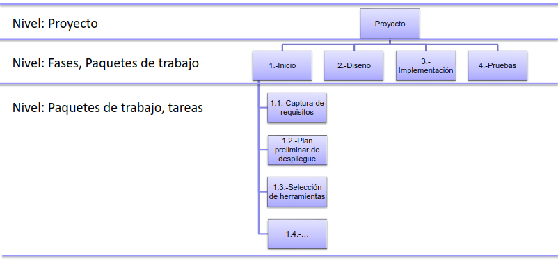

<!-- markdownlint-disable MD004 -->
# Tema 4 - Objetivos y alcance

- [Tema 4 - Objetivos y alcance](#tema-4---objetivos-y-alcance)
  - [Introducción](#introducción)
  - [Objetivos](#objetivos)
    - [Definir objetivos](#definir-objetivos)
    - [Redactar los objetivos](#redactar-los-objetivos)
  - [Alcance](#alcance)
    - [Alcance del proyecto](#alcance-del-proyecto)

## Introducción

* Objetivos
  * Describen los resultados esperados del proyecto.
* Alcance
  * Delimita el ambito de acciones y los requisitos que debe cumplir el producto o servicio entregable.
* Los objetivos y alcance deben de ser coherentes con lo que se puede y no hacer ademas de ir alineados con la vision y mision del proyecto.
* Los objetivos y el alcance deben revisarse y ajustarse para adaptarse a los cambios del entorno, clientes o usuarios.

## Objetivos

### Definir objetivos

* Identificar interesados
* Identificar lo que quieren los interesados
* No todas las necesidades de los interesados son objetivos del proyecto

### Redactar los objetivos

* Satisfacer los objetivos de los interesados
* Una unica redaccion para todos los interesados
* Objetivos SMART
  * Specific - Especifico
  * Measurable - Medible
  * Achievable - Alcanzable
  * Relevant - Relevante
  * Time-bound - Limitado en el tiempo
* Los objetivos se redactan como verbos
* Dos tipos de objetivos
  * Generales
    * Claros y concisos, puede ser incluso uno solo.
  * Especificos
    * Metas a corto plazo para alcanzar el objetivo general.
* Errores comunes:
  * Objetvios dividios por interesados.
  * Confundir tareas con objetivos
  * Objetivos no realistas o mal acotados

## Alcance

* Alcances claro, completo y consensuado con los interesados.
* Incluye las caracteristicas y funcionalidades como el trabajo necesario para lograrlo.
* Dos tipos de alcance
  * Alcance del producto
    * Caracteristicas y funcionalidades del producto o servicio.
  * Alcance del proyecto
    * Tareas necesarias para entregar el producto o servicio.
    * EDT - Estructura de desglose del trabajo

### Alcance del proyecto

* Tareas necesarios para conseguir objetvios
* Dividir las tareas en subtareas
* Se incluyen las tareas en el EDT
* EDT
  * 
  * Todas las tareas forman el alcance del proyecto
  * Lo que no esta en el EDT no esta en el alcance del proyecto
* Suele haber "deliverables" o entregables
  * Cliente
    * Presupuestos
    * Prototipos
    * ...
  * Equipo
    * Documentacion de Objetivos del Proyecto (DOP)
    * Analisis
    * Diseños
    * ...
* Se establecen hitos o fechas claves
  * Hito
    * Momento importante
  * Entregables
    * DOP
    * Presupuestos
    * Resultados de las pruebas
* Erroes comunes:
  * Añadir requsitos del alcance del producto al alcance del proyecto
  * Añadir tareas que no son necesarias o al final
  * Falta de especificidad en las tareas
