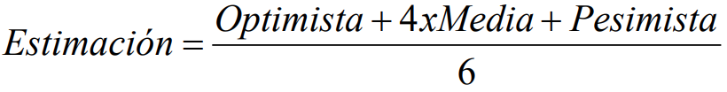

<!-- markdownlint-disable MD004 -->
# Tema 5 - Estimación de esfuerzo en desarrollo de software

- [Tema 5 - Estimación de esfuerzo en desarrollo de software](#tema-5---estimación-de-esfuerzo-en-desarrollo-de-software)
  - [Introducción](#introducción)
  - [Metodos para la estimación](#metodos-para-la-estimación)
  - [Puntos de Función](#puntos-de-función)
  - [COCOMO II](#cocomo-ii)

## Introducción

* Conocer el coste de desarrollo de un sistema
  * Esfuerzo
  * Dinero
  * ...
* Queremos saberlo cuanto antes para asignar tareas y personas

## Metodos para la estimación

* Experiencia
  * Juicio de experto
    * Puro
      * Un experto, en base a sus conocimientos, hace una estimación.
    * Delphi
      * Un grupo de expertos, debate, cada uno hace una estimación y se llega a un consenso mediante un coordinador. Si no se llega a un consenso, se repite el proceso.
    * Wideband Delphi
      * Igual que el Delphi pero los miembros deben dar explicaciones de sus estimaciones.
  * Estimación multipunto
    * Forma de estimar basada la opción optimista, pesimista y la media.
    * 
  * Analogia
    * Comparar el proyecto con otros similares teniendo en cuenta las diferencias.
      * Tamaño
      * Complejidad
      * Usuarios
      * ...
  * Distribución de la utilización de recursos en el ciclo de vida
    * Se coge la estimación de un proyecto similar y se divide en las mismas fases.
* Recursos
  * Parkinson
    * La estimación depende del numero de personas y del tiempo que se tienen.
    * > "El trabajo se expande hasta consumir todos los recursos disponibles" -> Ley de Parkinson
* Mercado
  * Precio para vender
    * Se prioriza obtener el contrato ajustando el precio al pago. Peligroso como única estimación.
* Componentes del producto
  * Bottom-up
    * Descomponer el proyecto en unidades lo mas pequeñas posible y estimar cada unidad.
  * Top-down
    * Se estima el proyecto completo y se descompone en tareas teniendo en cuenta la estimacion.
* Algoritmos
  * Puntos de Función
  * COCOMO II

## Puntos de Función

* 

## COCOMO II
