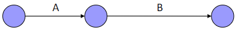
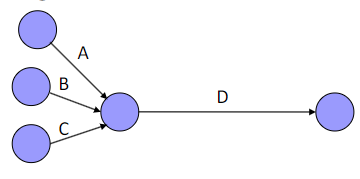
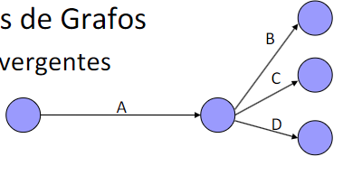
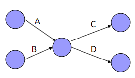

# Tema 6 - Planificación Temporal

- [Tema 6 - Planificación Temporal](#tema-6---planificación-temporal)
  - [6.1. Introducción](#61-introducción)
  - [6.2. Diagrama de Gantt](#62-diagrama-de-gantt)
  - [6.3. Pert](#63-pert)
  - [6.4. CPM](#64-cpm)
  - [6.5. ROY](#65-roy)
  - [6.6. Precedencia](#66-precedencia)

## 6.1. Introducción

- Tenemos:
  - Tareas que realizar
  - Un tiempo para realizarlas
  - Y alguien que las realice
- ¿Cómo planificar el tiempo?

## 6.2. Diagrama de Gantt

- Una grafica
  - Eje X: Tiempo
  - Eje Y: Tareas
  - Cada tarea se representa con una barra
    - La longitud de la barra representa el tiempo
    - La posición inicial representa el inicio
    - La posición final representa el fin
- Solo representa el tiempo
- No refleja:
  - El orden optimo de las tareas
  - Plazo minimo
  - Efectos de retrasos

## 6.3. Pert

- Objetivo:
  - Determinar la necesidad y fecha de las tareas
  - Buscar el plazo minimo
  - Buscar la union temporal de las tareas
  - Identificar las tareas criticas que forman el camino critico (tareas que no se pueden retrasar)
  - Detectar holguras (tiempo que se puede retrasar una tarea sin afectar el plazo final)
- El diagrama de Pert da como resultado un grafo.
  - Los nodos son momentos temporales.
  - Los arcos son tareas.
  - Solo puede haber un arco entre dos nodos.
- Tipos de grafos:
  - Lineales 
  - Convergentes 
  - Divergentes 
  - Convergentes-Divergentes 

## 6.4. CPM

## 6.5. ROY

## 6.6. Precedencia
